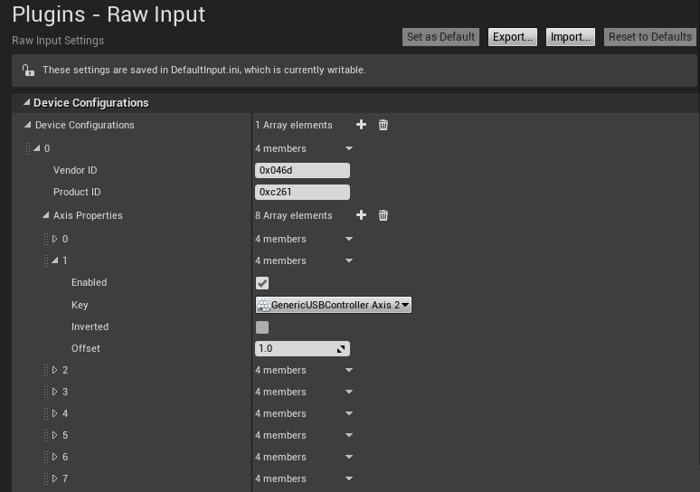

# Logitech G920 Steering Wheel Installation

To use Logitech G920 steering wheel with AirSim follow these steps:

1. Connect the steering wheel to the computer and wait until drivers installation complete.

2. Install Logitech Gaming Software from [here](http://support.logitech.com/en_us/software/lgs)

3. Before debug, you’ll have to normalize the values in AirSim code. Perform this changes in CarPawn.cpp (according to the current update in the git):  
  In line 382, change “Val” to “1 – Val”. (the complementary value in the range [0.0,1.0]).  
  In line 388, change “Val” to “5Val - 2.5” (Change the range of the given input from [0.0,1.0] to [-1.0,1.0]).  
  In line 404, change “Val” to “4(1 – Val)”. (the complementary value in the range [0.0,1.0]).
 
4. Debug AirSim project (while the steering wheel is connected – it’s important).

5. On Unreal Editor, go to Edit->plugins->input devices and enable “Windows RawInput”.

6. Go to Edit->Project Settings->Raw Input, and add new device configuration:  
  Vendor ID: 0x046d (In case of Logitech G920, otherwise you might need to check it).  
  Product ID: 0xc261 (In case of Logitech G920, otherwise you might need to check it).  
  Under “Axis Properties”, make sure that “GenericUSBController Axis 2”, “GenericUSBController Axis 4” and “GenericUSBController Axis 5” are all enabled with an offset of 1.0.  
  Explanation: axis 2 is responsible for steering movement, axis 4 is for brake and axis 5 is for gas. If you need to configure the clutch, it’s on axis 3.
  
  

7. Go to Edit->Project Settings->Input, Under Bindings in “Axis Mappings”:  
  Remove existing mappings from the groups “MoveRight” and “MoveForward”.  
  Add new axis mapping to the group “MoveRight”, use GenericUSBController axis 2 with a scale of 1.0.  
  Add new axis mapping to the group “MoveForward”, use GenericUSBController axis 5 with a scale of 1.0.  
  Add a new group of axis mappings, name it “FootBrake” and add new axis mapping to this group, use GenericUSBController axis 4 with a scale of 1.0.
  
  
  
8. Play and drive !

### Pay Attention

Notice that in the first time we "play" after debug, we need to touch the wheel to “reset” the values. 

### Tip

In the gaming software, you can configure buttons as keyboard shortcuts, we used it to configure a shortcut to record dataset or to play in full screen.
